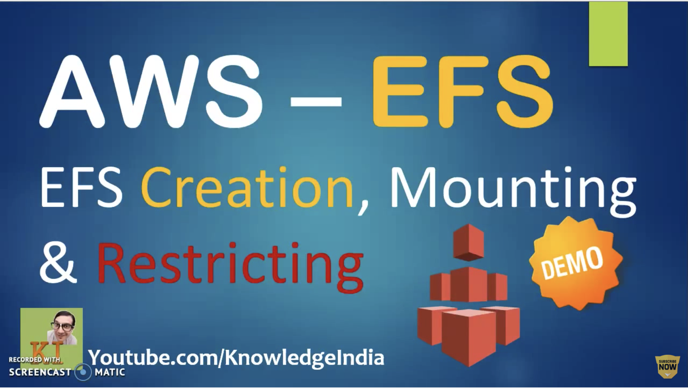

# Inspiration

Inspiration for this repo was a YouTube tutorial from [KnowledgeIndia](https://www.youtube.com/knowledgeIndia) where it was shown how to create and mount an EFS resource to a couple of linux machines.

<p align="left">
  <a href="https://youtu.be/M9CP42BsB6c">
    
  </a>
</p>

## Scope

I wanted to take a step further and automate the instructions. This includes:

- Using modules from Terraform registry
- Using cloud init config as user-data
- Encrypting data at rest

The idea is that infrastructure should be setup without human intervention

## Terraform commands

This is how infrastrucutre is setup with Terraform:

- See instruction on how to generate a new [SSH key](https://help.github.com/en/github/authenticating-to-github/generating-a-new-ssh-key-and-adding-it-to-the-ssh-agent) and adding it to the ssh-agent
- `export TF_VAR_public_key=$(ssh-keygen -y -f ~/.ssh/id_rsa)` _(This will be required unless public_key in variables.tf is already set. This public ssh key will be placed on the launched EC2 instances. And a user called "admin" will be able to log in without a password)_
- `terraform init`
- `terraform apply -auto-approve`

The commands above will cuase the following to happen in your AWS account:

1. Create a VPC with three subnets; 2x private and 1x public
1. Pass cloud config templates to relevant EC2 instances during launch time. These templates contains scripts to mount EFS
1. Create security groups needed for SSH and EFS ports
1. Create EFS resources that will be added to EC2 instances
1. Launch two EC2 instances in private subnets
1. Launch one EC2 instance in public subnet. This EC2 instance will act as a jump box to private EC2 instances

```
.
├── README.md
├── asg.tf                  -> Launch EC2 instances in private and public subnets
├── cloud-config-efs.tpl    -> Containing scripts that add ssh key & EFS to EC2 instances
├── data.tf                 -> Contains a filter for selecting latest EC2 AMI
├── efs.tf                  -> Creates EFS resources that will be added to EC2 instances
├── outputs.tf              -> Outputs EFS id
├── pics
│   └── efs.png
├── provider.tf             -> Sets AWS provider and optionally configures S3 backend for saving state file remotely
├── security.tf             -> Creates security groups needed for SSH and EFS ports
├── terraform.tfvars        -> Sets region and EC2 instance type variables
├── variables.tf
└── vpc.tf                  -> Creates a VPC with 2x private and 1x public subnets. Private subnets will have access to internet via a NAT gateway
```

## Test

1. Once Terraform has finised the execution successfully, please wait for about 5mins for all reasources to be created and be in ready state
1. SSH to each private EC2 instance in turn. See the AWS console for EC2 instances' details
    - `ssh admin@[PUBLIC_INSTANCE_IP]`
    - `ssh admin@[FIRST_PRIVATE_INSTANCE_IP]`
1. Check "/efs" folder is created and then plase some content in that folder.
1. SSH to the second box and check for the content created above. It should be the same
    - `ssh admin@[SECOND_PRIVATE_INSTANCE_IP]`
1. once all done, exit from your EC2 instances and then you may delete the infrastructure
    - ``terraform destroy -auto-approve``

## Reference

- [Add EFS to an Amazon Linux 2 AWS EC2 Instance with Terraform](https://medium.com/@wblakecannon/add-efs-to-an-amazon-linux-2-aws-ec2-instance-with-terraform-bb073b6de7)
- [cloud-init Documentation](https://cloudinit.readthedocs.io/)
- [Terraform Registry](https://registry.terraform.io/)
